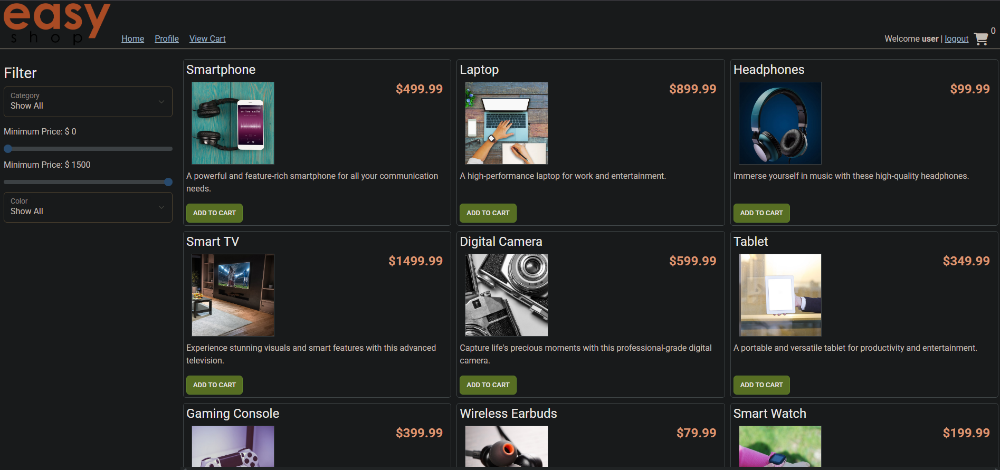
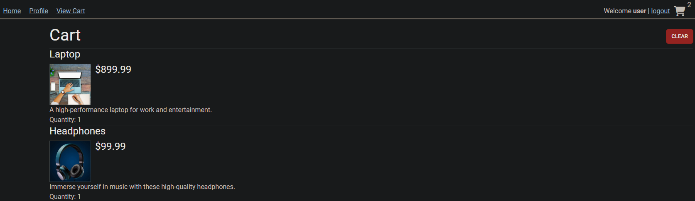

# 🛒 EasyShop - E-commerce Web Application

EasyShop is a Java Spring Boot-based e-commerce platform that allows users to browse products, filter by category or color, and manage a shopping cart. It also includes user authentication and admin functionality for managing product data.

---

## 📸 Screenshots

<details>
<summary>🧾 Home/Product Page</summary>

</details>

<details>
<summary>🛍️ Cart</summary>

</details>

---

## ⚙️ Tech Stack

- Java 17
- Spring Boot
- Thymeleaf (or raw HTML templates)
- JDBC / DAO Pattern
- MySQL
- Postman for API testing

---

## 🚀 Features

- 🔐 User Authentication
- 📦 Browse and filter products
- 🧮 Add/update/delete items in the shopping cart
- 🗂️ Category-based filtering
- 🖼️ Static image serving from `/images/products`

---

## 📂 Project Structure

<details>
<summary>Click to Expand</summary>

capstone-starter/

├── database/

├── images/

│   └── products/

├── src/

│   └── main/

│       ├── java/

│       │   └── org/

│       │       └── yearup/

│       │           ├── configurations/

│       │           ├── controllers/

│       │           ├── data/

│       │           └── models/

│       └── resources/

│           ├── static/

│           └── templates/

</details>


---

## 💡 Favorite Piece of Code

This method from `ShoppingCartController.java` automatically adds a product to a user’s cart and links it to their authenticated identity:

```java
@PostMapping("/cart/products/{productId}")
public void addToCart(@PathVariable int productId, Principal principal) {
try {
String userName = principal.getName();
User user = userDao.getByUserName(userName);
int userId = user.getId();

shoppingCartDao.addItem(userId, productId, 1); // adds 1 by default
} catch (Exception e) {
throw new ResponseStatusException(HttpStatus.INTERNAL_SERVER_ERROR, "Could not add product to cart.");
}
}
```

## 👤 Author

**Joshua Manzano**  
Year Up Software Development Program  
Capstone Project – 2025 
